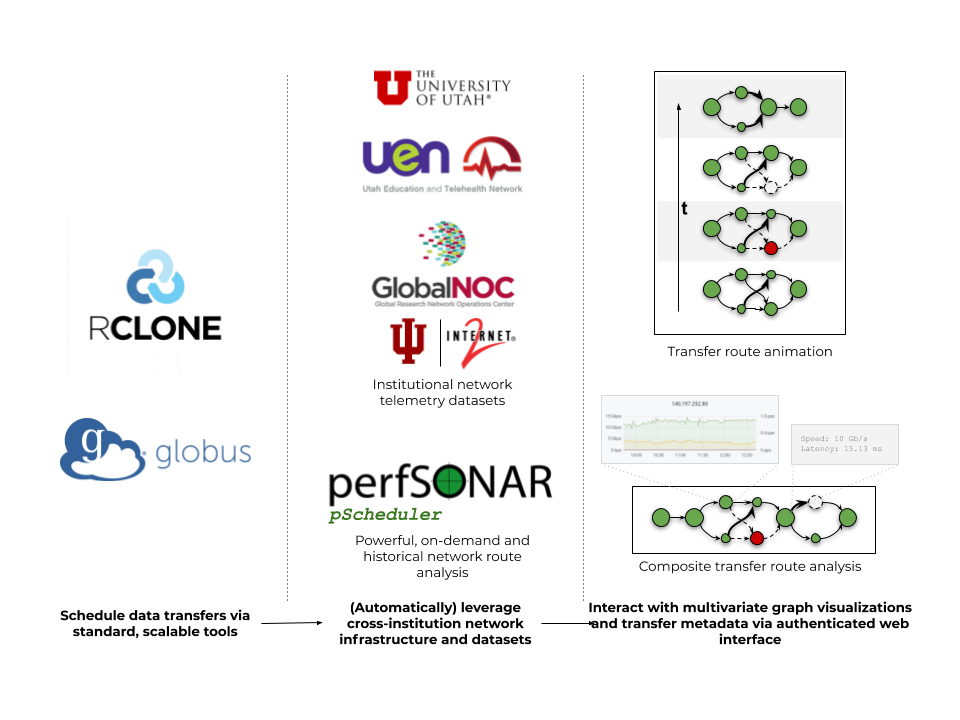
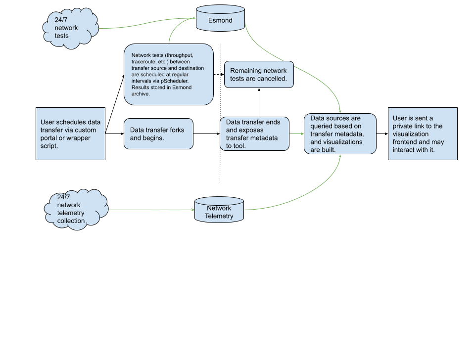

# Temporal analysis of network routes for scientific data transfers

Paul Fischer, Joe Breen (U of Utah CHPC)

## Service overview (U of U CHPC perspective)

## Dataflow diagram

## Scope

* Focused primarily on general-purpose research computing applications, specifically large scientific data transfers between geographically distant cooperating institutions
* Not a general internet topology tool (e.g. [CAIDA ITDK](https://www.caida.org/data/internet-topology-data-kit/))

## Tentative feature list

* A custom Globus transfer interface that interacts with [perfSONAR pSchedulers](https://docs.perfsonar.net/pscheduler_intro.html) at transfer endpoints to gather route diagnostics
* Drivers/glue for database access to [perfSONAR Esmond](https://docs.perfsonar.net/esmond_api_rest.html) and telemetry timeseries databases
* Custom interactive web visualizations in [d3.js](https://d3js.org/)
* An authenticated science gateway (website) that brings everything together

## Key points
1) A traceroute data hierarchy consisting of high-frequency, on-demand data (i.e. running traces near/during a data transfer window like I achieved with the Globus wrapper script), local historical data for similar transfers/routes (i.e. ~hourly traces to a set of common endpoints), and public datasets like Macroscopic ITDK to infer gaps.
2) Keep traceroutes "un-aggregated" (as opposed to merging everything up front as I've done with Neo4j so far), and use selections on timestamp and perhaps other features to show how routes change with respect to these features. For instance, given a particular transfer or time range, generate an animation showing how that route behaves over time.
3) Integrate with network telemetry data (Augmented Traceroute) to augment the static visualizations (click an node/edge to view telemetry data for that element) as well as animations (e.g. use moving "packets" or edge thickness to show current loads)
4) Package everything as a tool that can be put in the hands of admins/users to analyze their own data transfers.

## Resources

perfSONAR: https://www.perfsonar.net/about/what-is-perfsonar/

Center for Applied Internet Data Analysis (CAIDA) @ UCSD: https://www.caida.org/home/

GlobalNOC @ Indiana University: https://globalnoc.iu.edu/

